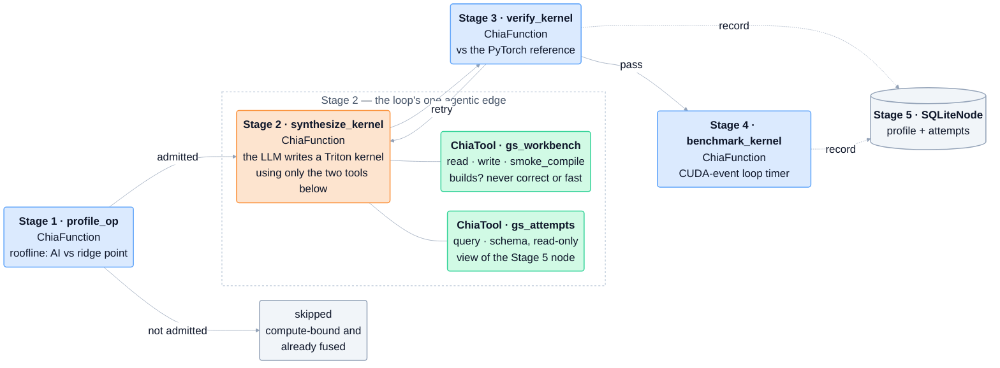

# GraphSynth as a CHIA loop

**A3 @ MICRO 2026 — CHIA Hackathon submission**

An agentic loop, built on [CHIA](https://github.com/ucb-bar/chia), that
synthesizes Triton kernels for attention variants PyTorch's fused-kernel
catalog does not cover, gates them on numerical correctness, and measures the
survivors on hardware.



Blue nodes are **programmatic**: the orchestration program invokes each
`ChiaFunction` directly and decides what happens next. The orange node is the
loop's **one agentic edge** — inside it a model drives the work by calling the
two MCP tools shown, and nothing else. `verify_kernel` and `benchmark_kernel`
are never registered with any `ChiaTool`, so the agent cannot call, inspect or
influence the gate that judges it.

Ten attention variants. **10/10 verified on an A100** at a geometric mean of
10.83x over eager PyTorch, and **9/10 re-verified and re-timed on an L40S** at
32.02x — a second device that tests the mechanism rather than repeating the
measurement.

---

## Quick start

No GPU, no API key, no credentials. About a minute.

```bash
git clone https://github.com/JoshiP-commits/CHIA_HACKATHON.git
cd CHIA_HACKATHON
pip install -r requirements.txt
python -m chia_loop.loop --bypass chia_loop/configs/bypass_replay.yaml
```

```
accepted 10/10
geometric mean speedup over eager: 10.83x
```

Every node is really scheduled on Ray with its declared resources, the MCP tool
servers really start, the four stages really run and the attempts database
really fills. Only the node *bodies* are replaced by recorded data, using
CHIA's `Bypass` — which the CHIA paper (4.3.6) names replaying
non-deterministic LLM calls as the motivating case for.

**On a bf16 GPU**, one flag makes the compiles, the verification and the timing
real: see [RUNNING.md](RUNNING.md).

---

## Documentation

| | |
|---|---|
| **[RUNNING.md](RUNNING.md)** | how to run each of the three modes, expected output, troubleshooting |
| **[chia_loop/README.md](chia_loop/README.md)** | the design: programmatic vs agentic edges, why the verifier is unreachable from the agent, the admission gate |
| **[RESULTS_L40S.md](RESULTS_L40S.md)** | the cross-device experiment, what real execution found, and the limitations |

---

## Three ways to run it

| Mode | Needs | What actually executes |
|---|---|---|
| `bypass_replay.yaml` | nothing | the loop's graph, scheduling, tools and database; node bodies replayed |
| `bypass_synthesis_only.yaml` | a bf16 GPU | **everything except the LLM call** — kernels really compile, verify and get timed |
| no `--bypass` | GPU + Vertex AI | the full live loop |

The middle mode is the useful one on a GPU without Vertex credentials: recorded
kernels are fed in as if the agent had just written them, then genuinely
compiled for your hardware, checked against the PyTorch reference and timed.

The third has **not been run** — see [Limitations](RESULTS_L40S.md#limitations).

---

## Results

### A100-SXM4-40GB — 10/10, geomean 10.83x

The recorded run. Reproduced exactly by `bypass_replay.yaml` on any machine.

### NVIDIA L40S — 9/10, geomean 32.02x

Real compiles, real verification, real timing. The speedup nearly triples, and
the reason is the point of the experiment:

| | |
|---|---|
| eager attention, L40S vs A100 | **1.795x** slower |
| predicted from bandwidth alone (1555/864) | **1.800x** |
| the synthesized kernels | **0.55x–0.88x** — *faster*, on the slower-bandwidth device |

Eager materialises the S x S score matrix to DRAM, so its runtime should scale
with 1/bandwidth and nothing else. It does, to 0.3%. The fused kernels never
materialise it, so they ride the L40S's higher bf16 throughput instead. The
measured speedup rises because the baseline lost the resource it depends on,
not because the kernels changed.

Running on hardware for the first time also found three bugs in this
repository that no replay could have caught — including one where the
verification gate was right and the reference it compared against was wrong.
All three are documented in [RESULTS_L40S.md](RESULTS_L40S.md).

---

## Repository layout

| | |
|---|---|
| `chia_loop/` | the loop — four `ChiaFunction` nodes, one `ChiaTool`, the bypass providers |
| `results/` | recorded runs: per-operator latencies, relative errors, backend choice, console logs |
| `kernels_gemini25pro_2346/`<br>`kernels_gemini31propre_0018/`<br>`kernels_sigmoid_fix/` | the Triton kernels, as the model wrote them |
| `provenance/` | the standalone scripts the recordings came from |
| `diagnose_sigmoid.py` | splits `verify_kernel`'s two input scales apart; the tool that localised the reference bug |

`provenance/` exists so the numbers can be traced rather than trusted.
`chia_loop/ops.py` and `chia_loop/timing.py` state where their contents came
from; those scripts are here so the claim can be checked with `diff` — including
the one place they deliberately differ, the sigmoid causal mask, where `ops.py`
follows the corrected `sigmoid_fix.py` rather than `synth10.py`.
`provenance/verify_paper_numbers.py` recomputes every published statistic from
the CSVs and needs no GPU.

Nothing in `chia_loop/` imports anything from `provenance/`.

---

## License

MIT. See [LICENSE](LICENSE).
