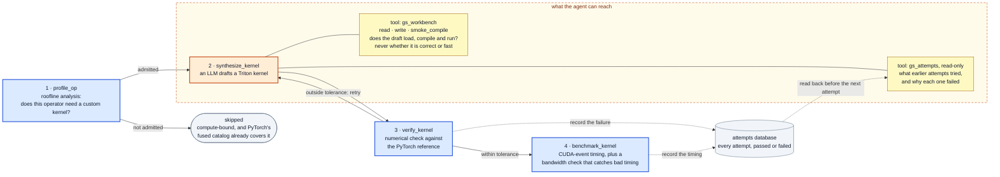

# GraphSynth as a CHIA loop

GraphSynth expressed in [CHIA](https://chialoops.ai): a closed loop that
synthesizes Triton kernels for attention variants PyTorch's fused-kernel
catalog does not cover, gates them on numerical correctness, and measures the
survivors on hardware.



## Run it without a GPU

```bash
pip install chialoops
python -m chia_loop.loop --bypass chia_loop/configs/bypass_replay.yaml
```

Reproduces the paper's result in about a minute on a laptop:

```
accepted 10/10
geometric mean speedup over eager: 10.83x
```

## Three ways to run it

| | needs | what actually executes |
|---|---|---|
| `bypass_replay.yaml` | nothing | the loop's graph, tools and database; node bodies replayed |
| `bypass_synthesis_only.yaml` | a bf16 GPU | **everything except the LLM call** — kernels really compile, verify and get timed |
| no `--bypass` | GPU + Vertex AI | the full live loop |

The middle one is the useful mode on a GPU you have but without Vertex
credentials: the recorded kernels are fed in as if the agent had just written
them, then genuinely compiled, verified against the PyTorch reference and timed
on your hardware.

Every node is really scheduled on Ray with its real resource requirements, the
MCP tool servers really start, the attempts database really fills — only the
node *bodies* are replaced by the recorded A100 run, using CHIA's `Bypass`
(CHIA paper, 4.3.6, which names replaying non-deterministic LLM calls as the
motivating case). For a live run see `configs/live_local.md`.

## Running on hardware other than the A100

Two things are device-specific and are not inferred automatically.

**Resources.** Ray sets `CUDA_VISIBLE_DEVICES` in a worker from the resources
that task requested, so a measurement node that declares nothing is handed an
empty device list and torch reports `No CUDA GPUs are available` on a machine
whose GPU is sitting idle. `nodes.py` therefore declares `num_gpus=1` on a
single machine with a GPU, the virtual `a100` resource under
`GRAPHSYNTH_MODE=cluster`, and nothing at all when there is no GPU, so the
CPU-only replay still runs. `GRAPHSYNTH_FORCE_CPU=1` forces that last case.

**Roofline constants.** The defaults describe the A100-SXM4-40GB the recorded
run was measured on. The ridge point that stage 1 compares against, and the
bandwidth-utilisation check that stage 4 uses to falsify bad timing, are only
meaningful for the device actually running:

```bash
# L40S (Ada, sm89): 864 GB/s, 362 TFLOP/s dense bf16
python -m chia_loop.loop --bypass chia_loop/configs/bypass_synthesis_only.yaml \
    --peak-bw 864e9 --peak-flops 362e12
```

Speedups are ratios against eager on the same device, so they are comparable
across hardware; absolute latencies are not.

## The design decision that matters

CHIA distinguishes **programmatic** edges, driven by the orchestration program,
from **agentic** edges, driven by a model's tool call. Which stages get which is
the whole argument of this loop.

| Stage | Node | Edge |
|---|---|---|
| 1. Roofline classification | `profile_op` | programmatic |
| 2. Kernel synthesis | `synthesize_kernel` | **agentic** |
| 3. Correctness gate | `verify_kernel` | programmatic |
| 4. Hardware measurement | `benchmark_kernel` | programmatic |
| 5. Persist | `SQLiteNode.execute` | programmatic |

The agent gets exactly two tools:

- **`KernelWorkbenchTool`** — read and write its draft, plus `smoke_compile`,
  which reports whether the code *builds*. It never reports correctness or
  latency, so there is no score in it to climb.
- **`SQLiteQueryTool(read_write=False)`** — the attempts database, read-only.
  `read_write=False` omits `execute` from the MCP registration, so the surface
  the agent can reach offers `query` and `schema` and nothing else. It can read
  what previous iterations tried and why they failed, and decide for itself
  what is relevant, as in CHIA's gem5 loop.

`verify_kernel` and `benchmark_kernel` are never registered with any
`ChiaTool`. The agent cannot call them, inspect them or modify them; it sees
only the traces they emit. This follows CHIA's isolation principle (5.2) and
its warning about reward hacking (5.4.1), where an evolutionary agent was
caught gaming an assertion to fake a memory-traffic win. A gate the agent can
reach is a gate the agent will eventually optimise instead of the kernel.

`cluster_a100.yaml` carries the same split into the deployment: the synthesis
worker holds Vertex credentials and no GPU, the measurement worker holds a GPU
and no credentials.

## Stage 1 admission, and an honest correction

An operator is admitted when **either**

1. it is memory-bound, `AI < FLOP_peak / BW_peak`; a mask of density *d* scales
   the FLOP count while leaving minimum DRAM traffic unchanged, so sparsity
   moves an operator along this axis; **or**
2. PyTorch's fused path cannot express it.

Clause 2 is not decoration. Five of the ten variants — ALiBi, logit
soft-capping, per-head temperature, ReLU and sigmoid attention — are *dense*
score modifications with AI ≈ 1024 against a bf16 ridge point of 200.6. By
clause 1 alone they are compute-bound and would be skipped, yet they are
exactly the operators this loop optimises, with speedups from 5.1× to 18.1×.

The resolution: clause 1 classifies the *ideal fused* kernel, using minimum
traffic. For these operators no such kernel exists, so eager PyTorch
materialises the S×S score matrix and the implementation that actually runs is
bandwidth-bound even though the ideal one would not be. Run the loop and
`profile_op` prints `memory-bound False | admitted True` for each of them —
the two clauses disagreeing is the visible signature of the gap.

## Layout

| File | |
|---|---|
| `nodes.py` | the four `ChiaFunction` stages |
| `tools.py` | `KernelWorkbenchTool` — the entire agent-reachable surface |
| `loop.py` | orchestration, gates, feedback |
| `ops.py` | the ten operators and their references, from `synth10.py` except the
sigmoid mask, which follows the corrected `sigmoid_fix.py` |
| `timing.py` | the validated loop timer, verbatim from `final_bench.py` |
| `state.py` | typed edge payloads |
| `replay.py` | `Bypass` providers over the recorded run |
| `configs/` | bypass, cluster, and live-run notes |

## Reusable blocks

CHIA's library covers RTL, simulators and VLSI; it has no GPU kernel-synthesis
nodes. Three here are written to be lifted out independently: `profile_op`
(roofline classification for any GPU operator), `verify_kernel` (a
reference-comparison gate parameterised by dtype tolerance), and
`benchmark_kernel` (loop-timed latency with a bandwidth-utilisation check that
falsifies bad timing methods).

## What ran where

The measurements come from an A100-SXM4-40GB via the standalone implementation
in `provenance/`, which these nodes wrap. The replay above executes the
loop's graph, scheduling, tools and database for real against that recorded
data. It does not re-measure. A live run needs a bf16-capable GPU and Vertex AI
credentials; `configs/live_local.md` has the command.
